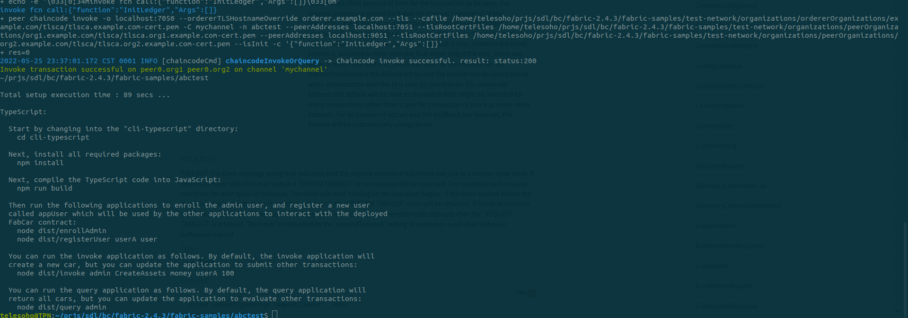
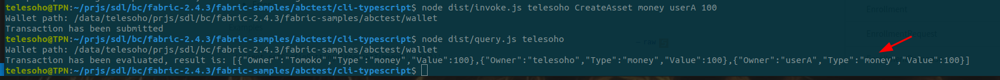
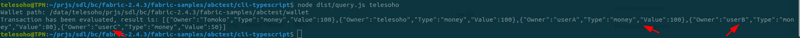
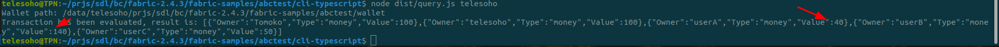
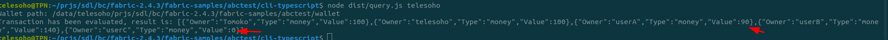
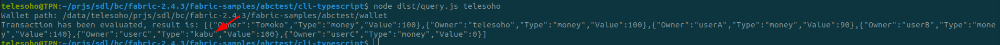

# Odoo モジュールとしての NFT Client 作成

- [Odoo モジュールとしての NFT Client 作成](#odoo-モジュールとしての-nft-client-作成)
  - [目標](#目標)
    - [NFT 連携シナリオ](#nft-連携シナリオ)
    - [計画](#計画)
  - [fabric-samplesのインストール](#fabric-samplesのインストール)
  - [シナリオの専用 Chaincode「abctest」作成と起動](#シナリオの専用-chaincodeabctest作成と起動)
    - [Chaincode 作成](#chaincode-作成)
    - [abctest の Network 起動](#abctest-の-network-起動)
    - [cli ツールでシナリオ実行](#cli-ツールでシナリオ実行)
  - [REST API 開発](#rest-api-開発)
    - [API 設計](#api-設計)
    - [シナリオテスト履歴](#シナリオテスト履歴)
  - [Odoo モジュール開発](#odoo-モジュール開発)

## 目標

下記の NFT シナリオを実装します、BlockChain の Network は Fabric で構築します、UI は Odoo で実装します。

### NFT 連携シナリオ

・ユーザ：管理者ユーザ、ユーザ A、ユーザ B ユーザ C

アクション

管理者ユーザがユーザ A に対して新規アセットを付与し Value 値は 100 とする。

管理者ユーザがユーザ B に対して新規アセットを付与し、Value 値は 80 とする。

管理者ユーザがユーザ C に対して新規アセットを付与し、Value 値は 50 とする。

ユーザ A がユーザ B に Value を 60 譲渡する

（B>A および C>A を確認）

ユーザ C がユーザ A に Value を 50 譲渡

（A>C および B>A を確認）

管理者ユーザがユーザ C に対し、新規アセットを付与し、Value 値を 100 とする。

仕様：異なるアセットのバリューは合計して評価する

（C ＞ B を確認する。）

### 計画

1. 検証と便利のため、[fabric-samples](https://github.com/hyperledger/fabric-samples) の test-network を利用して Network を構築します。
2. 連携シナリオによって、既存の Sample がありませんので、独自の ChainCode を作成が必要です。
3. [fabric-samples](https://github.com/hyperledger/fabric-samples)の test-network は組織`org1.example.com`と`org2.example.com`２つありますので、`org1.example.com` のみを利用します。
4. まず、[fabric-samples]の CLI ツールで、上記の NFT シナリオを実現します
5. Odoo で、直接 Fabric SDK を利用できないので、express.js で新規開発 ChainCode に対しての REST API を開発が必要です。
6. Odoo と新規開発 REST API を利用して fabric_abctest と連携して、上記シナリオを実現します。

## [fabric-samples](https://github.com/hyperledger/fabric-samples)のインストール

```sh
$ sudo apt-get update -y
$ sudo apt-get upgrade -y
$ sudo apt-get install git curl docker-compose -y
```

Version を確認します

```sh
$ docker --version
Docker version 20.10.12, build 20.10.12-0ubuntu4
$ docker-compose --version
docker-compose version 1.29.2, build unknown
```

Docker 起動確認

```sh
$ sudo systemctl start docker
$ sudo systemctl enable docker
```

ユーザーグループを追加して、再起動

```sh
$ sudo usermod -aG docker $USER
$ sudo reboot
```

実行ファイルとサンプルのインストール

```sh
$ mkdir -p ~/prjs/sdl/bc/fabric-2.4.3
$ cd ~/prjs/sdl/bc/fabric-2.4.3
$ curl -sSL https://bit.ly/2ysbOFE | bash -s -- 2.4.3 1.5.2
```

## シナリオの専用 Chaincode「abctest」作成と起動

### Chaincode 作成

シナリオ専用の ChainCode を先に作成しましたので、下記の命令で Github から fabric-sample フォルダにダンロードします

```sh
$ cd fabric-samples
$ git clone https://github.com/telesoho/abctest.git
```

### abctest の Network 起動

```sh
$ cd abctest
$ ./networkStart.sh
```



### cli ツールでシナリオ実行

npm がインストールされてない場合は、NPM を先にインストールします

```sh
$ sudo apt install npm

```

cli ツールを Build します

```sh
$ cd cli-typescript
$ npm run build
```

1. ユーザ作成
   ・ユーザ：管理者ユーザ、ユーザ A、ユーザ B ユーザ C

システム管理員(admin)作成：

```sh
$ node dist/enrollAdmin.js
Wallet path: /data/telesoho/prjs/sdl/bc/fabric-2.4.3/fabric-samples/abctest/wallet
Successfully enrolled admin user "admin" and imported it into the wallet
```

管理者ユーザ「telesoho」作成：

```sh
$ node dist/registerUser.js telesoho admin
Wallet path: /data/telesoho/prjs/sdl/bc/fabric-2.4.3/fabric-samples/abctest/wallet
Successfully registered and enrolled admin user telesoho and imported it into the wallet
```

ユーザ A「userA」作成：

```sh
$ node dist/registerUser.js userA user
Wallet path: /data/telesoho/prjs/sdl/bc/fabric-2.4.3/fabric-samples/abctest/wallet
Successfully registered and enrolled admin user userA and imported it into the wallet
```

ユーザ B「userB」作成：

```sh
$ node dist/registerUser.js userB user
Wallet path: /data/telesoho/prjs/sdl/bc/fabric-2.4.3/fabric-samples/abctest/wallet
Successfully registered and enrolled admin user userB and imported it into the wallet
```

ユーザ C「userC」作成：

```sh
$ node dist/registerUser.js userC user
Wallet path: /data/telesoho/prjs/sdl/bc/fabric-2.4.3/fabric-samples/abctest/wallet
Successfully registered and enrolled admin user userC and imported it into the wallet
```

2. 既存のアセットを表示します

```sh
$ node dist/query.js telesoho
Wallet path: /data/telesoho/prjs/sdl/bc/fabric-2.4.3/fabric-samples/abctest/wallet
Transaction has been evaluated, result is: [{"Owner":"Tomoko","Type":"money","Value":100},{"Owner":"telesoho","Type":"money","Value":100}]
```

3. 管理者ユーザがユーザ A に対して新規アセットを付与し Value 値は 100 とする。

```sh
$ node dist/invoke.js telesoho CreateAsset money userA 100
Wallet path: /data/telesoho/prjs/sdl/bc/fabric-2.4.3/fabric-samples/abctest/wallet
Transaction has been submitted
```

結果を確認：



4. 管理者ユーザがユーザ B に対して新規アセットを付与し、Value 値は 80 とする。

```sh
$ node dist/invoke.js telesoho CreateAsset money userB 80
Wallet path: /data/telesoho/prjs/sdl/bc/fabric-2.4.3/fabric-samples/abctest/wallet
Transaction has been submitted
```

5. 管理者ユーザがユーザ C に対して新規アセットを付与し、Value 値は 50 とする。

```sh
$ node dist/invoke.js telesoho CreateAsset money userC 50
Wallet path: /data/telesoho/prjs/sdl/bc/fabric-2.4.3/fabric-samples/abctest/wallet
Transaction has been submitted
```

作成したアセットを確認します。



6. ユーザ A がユーザ B に Value を 60 譲渡する

```sh
$ node dist/invoke.js userA TransferTo money userB 60
Wallet path: /data/telesoho/prjs/sdl/bc/fabric-2.4.3/fabric-samples/abctest/wallet
Transaction has been submitted
```

（B>A および C>A を確認）



7. ユーザ C がユーザ A に Value を 50 譲渡

```sh
$ node dist/invoke.js userC TransferTo money userA 50
Wallet path: /data/telesoho/prjs/sdl/bc/fabric-2.4.3/fabric-samples/abctest/wallet
Transaction has been submitted
```

（A>C および B>A を確認）



8. 管理者ユーザがユーザ C に対し、新規アセットを付与し、Value 値を 100 とする。

```sh
$ node dist/invoke.js telesoho CreateAsset kabu userC 100
Wallet path: /data/telesoho/prjs/sdl/bc/fabric-2.4.3/fabric-samples/abctest/wallet
Transaction has been submitted
```

仕様：異なるアセットのバリューは合計して評価する

（C ＞ B を確認する。）



## REST API 開発

### API 設計

- ユーザ作成

```ini
POST {{apiUrl}}/user HTTP/1.1
content-type: application/json
X-Api-Key: {{api-key}}

{
    "username":"admin@odoo.com",
    "role":"admin"
}
```

- アセット表示

```ini
### アセット表示

GET {{apiUrl}}/assets HTTP/1.1
X-Api-Key: {{api-key}}

```

- アセット作成

```ini

### 管理者ユーザがユーザ B に対して新規アセットを付与し、Value 値は 80 とする。
POST {{apiUrl}}/assets HTTP/1.1
content-type: application/json
mspId:admin@odoo.com
X-Api-Key: {{api-key}}

{
    "Type": "money",
    "Owner": "userB@odoo.com",
    "Value": 80
}

```

- Value 譲渡

```ini

### 管理者ユーザがユーザ C に対し、新規アセットを付与し、Value 値を 100 とする。

POST {{apiUrl}}/assets HTTP/1.1
content-type: application/json
mspId:admin@odoo.com
X-Api-Key: {{api-key}}

{
    "Type": "kabu",
    "Owner": "userC@odoo.com",
    "Value": 100
}

```

### シナリオテスト履歴

[シナリオテスト履歴](../rest-api-typescript/abctest.http)

## Odoo モジュール開発

未完成
